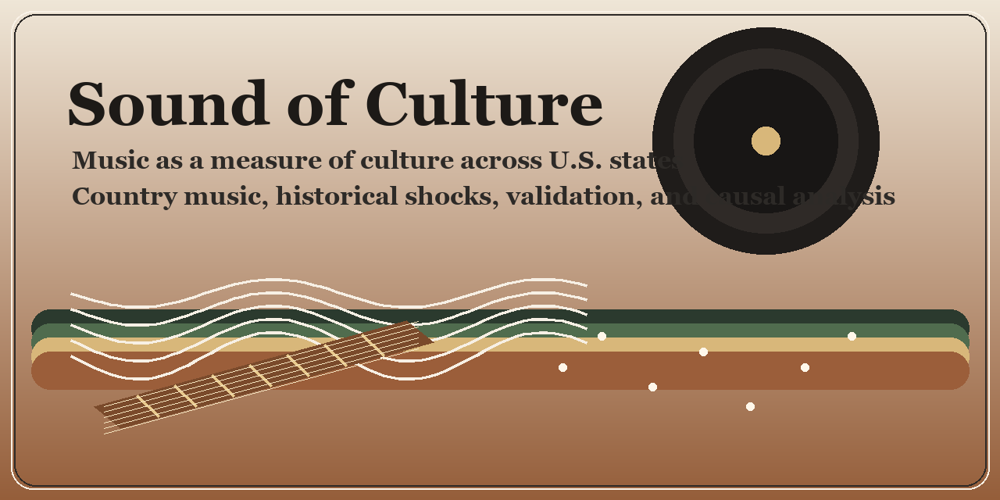

# Sound of Culture

This repository studies how music can be used as a measure of culture in the
United States.

The current project design has four canonical phases:

1. dataset construction
2. exploratory analysis
3. validation against external culture measures
4. causal applications using war deaths and the China shock

This README is the main onboarding file for collaborators and agents. It
explains the project logic, the folder structure, the installed shared tools,
the memory system, and the restructuring work already completed on the current
branch.

## Current project status

Active working branch:

- `codex/restructure-workspace-2026-04-18`

Current GitHub default branch:

- `codex/restructure-workspace-2026-04-18`

Archival branch that preserves the pre-restructure project state:

- `codex-archive-pre-restructure-2026-04-18`

Current restructuring status:

- block 1 completed: archival snapshot created and pushed
- block 2 completed: phase-based workspace skeleton created
- block 3 completed: directives, SOPs, and agent instructions rewritten
- block 4 completed: Supermemory configured and validated in-session
- block 5 completed: code-review-graph standardized and rebuilt
- block 6 completed: phase-based Overleaf/report system standardized with
  canonical templates and folder conventions
- block 7 completed: GitHub-facing cutover prepared safely
- block 8 completed: phase-based wrappers introduced for the main execution
  surface
- block 9 completed: operational launchers and replication instructions shifted
  toward phase-based entrypoints
- block 10 completed: active internal imports started moving toward bridge
  modules
- block 11 completed: the bridge layer was runtime-validated on live Phase 1
  workflows
- block 12 completed: GitHub README links were repaired and artist-universe
  replication was validated through the phase-based surface
- block 13 completed: additional helper modules were bridged and helper
  imports reduced further
- block 14 completed: wrapper coverage was extended across the full active
  Python surface of `step1_download` and `step2_digitalize`
- block 15 completed: wrapper coverage was finished for the remaining active
  `step4_country_artists` / `step5_replication` surface, closing the
  operational restructuring pass
- block 16 completed: destructive cutover removed the active `execution/step*`
  trees after the validated pre-cutover snapshot was archived
- 2026-04-21 data-layout cleanup completed: `data/` now exposes the same
  phase-based structure as the research design, and legacy data roots were
  folded into the relevant phase folders
- 2026-04-21 Phase 1.2 rhythm enrichment completed: the final dataset now
  carries UG section-level `bpm_sections` and structured `strumming_patterns`
  fields

For a block-by-block history, see:

- [workspace_maps/restructure_block_history_2026-04-18.md](workspace_maps/restructure_block_history_2026-04-18.md)

## Research roadmap

### Phase 1: Dataset construction

The project first builds the artist and song-level raw material needed to turn
music into a cultural measure.

This phase has two distinct report objects:

- `country-only` and `adjacent-only` artist-universe construction
- final Ultimate Guitar dataset construction and missing-data recovery

### Phase 2: Exploratory analysis

The constructed dataset is then audited to:

- detect construction problems
- describe temporal patterns
- describe spatial patterns
- document early regularities that matter for later validation

### Phase 3: Validation

The music-based culture measure is then compared with external culture measures
across US states.

### Phase 4: Causal applications

The validated measure is then used in causal applications:

- war deaths from 1946 onward
- the China shock in US manufacturing

## Repository structure

The repository now runs on a phase-based architecture.

High-level structure:

- `AGENTS.md`
  Shared operating instructions for Codex and other agents.
- `directives/`
  Canonical SOP and phase directives.
- `execution/`
  Working code under the canonical `phase_*` directories.
- `reports/`
  Repo-side mirror of the canonical Overleaf report structure.
- `project_memory/`
  Shared written memory for cross-agent continuity.
- `workspace_maps/`
  Restructuring maps and transition documentation.
- `data/`
  Project data organized by the same phase structure as the research design.

Important subtrees:

- `execution/phase_01_dataset_construction/`
  Dataset construction logic, replication launchers, and helper modules.
- `execution/phase_02_exploratory_analysis/`
  Exploratory analysis scripts and generated figures.
- `execution/phase_03_validation/`
  Validation-phase execution surface.
- `execution/phase_04_causal_shocks/`
  Causal-application execution surface.
- `data/phase_01_dataset_construction/`
  Raw UG downloads, intermediate construction files, processed country datasets,
  validation-reference outputs, logs, and archived cold-start replication
  material.
- `data/phase_02_exploratory_analysis/`
  Processed Top 100 / year-end datasets and raw chord/bass material used by the
  exploratory scripts.
- `data/phase_03_validation/`
  External culture-measure inputs and validation outputs.
- `data/phase_04_causal_shocks/`
  War-deaths and China-shock data inputs and causal-shock outputs.
- `data/README.md`
  Canonical map of the phase-based data layout.

Current architecture interpretation:

- use the `execution/phase_*` directories as the only active execution surface
- legacy `execution/step*` code is no longer present in the active branch
- historical legacy layouts survive in archival branches, replication
  packages, and restructuring notes only

Current phase-based execution surfaces:

- `execution/phase_01_dataset_construction/`
- `execution/phase_02_exploratory_analysis/`
- `execution/phase_03_validation/`
- `execution/phase_04_causal_shocks/`

## Canonical report structure

The canonical narrative outputs live in Overleaf, not in the repo.

Overleaf root:

- `/Users/marcolemoglie_1_2/Library/CloudStorage/Dropbox/Applicazioni/Overleaf/Sound of culture`

Canonical report layout:

- `phase_01_dataset_construction/01_country_only_and_adjacent_only/`
- `phase_01_dataset_construction/02_final_dataset_ultimate_guitar/`
- `phase_02_exploratory_analysis/`
- `phase_03_validation/`
- `phase_04_causal_shocks/01_war_deaths/`
- `phase_04_causal_shocks/02_china_shock/`

Repo-side mirrors:

- `reports/phase_01_dataset_construction/`
- `reports/phase_02_exploratory_analysis/`
- `reports/phase_03_validation/`
- `reports/phase_04_causal_shocks/`

Block 6 standardized the Overleaf structure by creating phase-specific report
entry points and output folders for the phases that did not yet have a real
report file.

## Shared memory system

This project must be readable and operable by:

- Codex in this thread
- Antigravity
- a coauthor's Codex
- other MCP-aware coding tools configured on the same machine

There are two memory layers.

### 1. Repo-side written memory

This is mandatory and lives in:

- `project_memory/status/`
- `project_memory/decisions/`
- `project_memory/handoffs/`
- `project_memory/inventories/`

At minimum, each meaningful work unit should update:

- what changed
- what remains unresolved
- what the next agent should do
- whether a result was kept, rejected, or remains provisional

### 2. Supermemory

Supermemory is now operational for the project scope:

- `sound-of-culture`

Important rule:

- repo MCP files are intentionally secret-free
- authentication lives only in local client configuration
- the API key must never be committed

Current local Codex pattern:

- `~/.codex/config.toml`
- `bearer_token_env_var = "SUPERMEMORY_API_KEY"`
- header `x-sm-project = "sound-of-culture"`

For more detail, see:

- [project_memory/inventories/memory_system.md](project_memory/inventories/memory_system.md)

## Shared tools installed for this project

### code-review-graph

This is the primary structural exploration tool for Python and shell code.

Configured clients:

- Codex
- Cursor
- OpenCode
- Kiro
- local Antigravity

Important limit:

- current graph coverage is `python` and `bash` only
- it does not structurally index Stata, LaTeX, or data artifacts

That means graph-first is correct for code exploration, but direct file reads
remain necessary for Stata, Overleaf, and many outputs.

See:

- [directives/10_code_review_graph_sop.md](directives/10_code_review_graph_sop.md)
- [project_memory/inventories/review_graph_system.md](project_memory/inventories/review_graph_system.md)

### caveman-compression

Installed locally for Codex at:

- `~/.codex/vendor/caveman-compression`

Current install notes:

- dedicated virtual environment created
- NLP dependencies installed
- spaCy model download failed twice because of upstream GitHub `504` errors
- local install patched with a blank English pipeline fallback so it is still
  usable offline

See:

- [project_memory/inventories/local_tooling.md](project_memory/inventories/local_tooling.md)

## Repository presentation

The GitHub repository now uses:

- default branch: `codex/restructure-workspace-2026-04-18`
- About description: `Music as a measure of culture across U.S. states using country music data, validation, and social shocks.`
- repository banner image shown at the top of this README:
  `assets/github-social-preview.png`

GitHub's About panel on the right supports text metadata, while the main visual
identity is provided here in the README banner. The generated banner file can
also be reused manually as a social preview image in GitHub settings if needed.

## How a coauthor should start

1. Clone the repo and check out `codex/restructure-workspace-2026-04-18`.
2. Read:
   - `AGENTS.md`
   - `directives/README.md`
   - `project_memory/status/current_status.md`
   - `project_memory/handoffs/next_agent.md`
   - this `README.md`
3. Get access to the Overleaf/Dropbox project folder.
4. Configure local Supermemory authentication with the shared project scope
   `sound-of-culture`.
5. Never commit secrets.

## What must be documented every time

Every substantial new attempt must be reflected in the relevant phase report in
plain English, including:

All canonical phase reports in Overleaf must be written in English.

- what was done
- why it was done
- how it was done
- what code was used
- what outputs were generated
- whether the attempt is retained in the final workflow
- if dropped, why it was dropped

This rule applies even to discarded attempts if they informed the final
project.

## Current architecture rules

- The active branch is phase-based.
- New documentation should point only to phase-based entrypoints.
- Legacy execution layouts now live only in archival branches and packaged
  replication material.
- The repo still contains archival / replication snapshots such as
  `.coldstart_*`. These may create duplicate results in graph search and
  should not be confused with active working paths.

## Main reference files

- [AGENTS.md](AGENTS.md)
- [directives/README.md](directives/README.md)
- [project_memory/status/current_status.md](project_memory/status/current_status.md)
- [project_memory/handoffs/next_agent.md](project_memory/handoffs/next_agent.md)
- [reports/README.md](reports/README.md)
